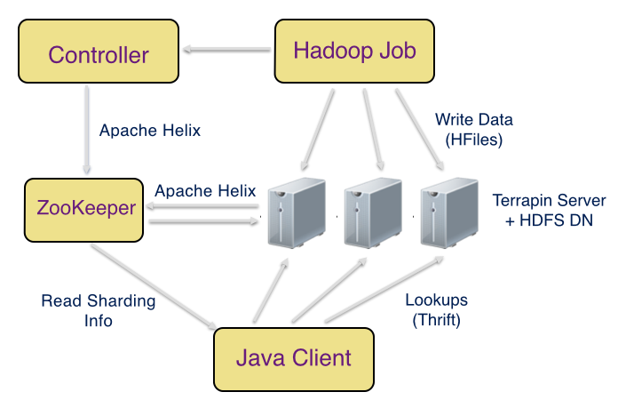

# Terrapin Design

## Prerequisites

This document assumes familiarity with [Apache HBase](http://hbase.apache.org) and
[Apache HDFS](http://hadoop.apache.org/docs/r1.2.1/hdfs_design.html).

## Objectives

Terrapin provides a key value data model for data generated by ETL jobs such as
MapReduce, Cascading pipelines and Hive queries. The data, once generated is immutable
and can only be regenerated fully. Terrapin must satisfy the following requirements:
   - **Scalability**: Terrapin must be horizontally scalable - it should be easy to add/remove
nodes.
   - **Fault Tolerance**: The system should replicate data and recover from machine failures.
   - **Performance**: Terrapin must provide p99 latencies in the millisecond range when
backed by SSD hardware.
   - **Fast & Robust uploads**: A Hadoop job should be able to directly stream data to Terrapin,
at high throughput.
   - **Multi tenant**: It should be easy to host several data sets. Adding/removing a
data set should not require any configuration changes or deploys.
   - **Versioning**: The data should be versioned and the versions should be independent.
It should be possible to tweak the number of shards & partitioning function across different
versions.
   - **Rollbacks**: Storing multiple versions of the data should be supported for critical
datasets. It should be possible to rollback to an older version, in case of a software bug.
   - **Extensible**: It should be easy to plug in different storage formats for
better performance or specialized use cases.

## Related work 

  - **Apache HBase**: Apache HBase is commonly used as the serving system for output
of Hadoop jobs. HBase provides a convenient Mapreduce output format to write directly
to HBase region servers or bulk upload HFiles. In practice, the direct writes approach
is quite slow and places heavy load on the HBase cluster. The more viable
option is to generate HFiles and upload them directly to the HDFS cluster running beneath
HBase. When the mapreduce job is running on a
different hadoop cluster, the data for an HBase region gets distributed all over
the cluster. Lack of data locality has a noticable impact on latency.
One needs to trigger a compaction to restore data locality.  Compactions are often more
expensive than the bulk load itself and noticably impact latency.

  - **ElephantDB**: With ElephantDB, data is first written locally, then uploaded
to a distributed filesystem such as HDFS/S3 and finally distributed across a ring
servers. Adding new data sets requires making configuration changes. Its hard to
tweak the number of output shards within a data set. Adding nodes requires modification
of configuration files.

  - **Cassandra**: With Cassandra, data (written as sstables) can be bulk uploaded to
a Cassandra cluster. However, it is also a multistep process where the data is first generated
locally and then streamed to the Cassandra cluster. The Cassandra nodes then generate
the bloom filters and indices before loading it into serving.
Compactions are needed to get rid of older data.

## Architecture

Terrapin uses HDFS as the underlying storage for its scalability, elasticity
and fault tolerance. Data is versioned and garbage collection of older versions
is cheap, as opposed to running expensive compactions in HBase. Terrapin takes the
distribution of HDFS blocks into account and brings up corresponding serving shards
on the same nodes that physically store the HDFS blocks.
Moreover, Hadoop ETL jobs can directly stream data into HDFS.

The above figure illustrates the various components of Terrapin. A Hadoop job writes
data in the form of HFiles to a Terrapin cluster, backed by HDFS. The Terrapin
cluster consists of the following:
- A **ZooKeeper quorum** stores the cluster state, propagates it to the client and
helps drive cluster coordination.
- A **Terrapin server** process runs on each HDFS data node. The Terrapin server
is responsible for serving key-value lookups against HFiles. The Terrapin server
interacts with the ZooKeeper to receive notifications as to which HFiles need to be served.
- The **Terrapin controller** periodically queries the current HDFS block
locations for each HFile, computes the appropriate notifications to be sent
to Terrapin servers and writes them to ZooKeeper. The controller ensures data
locality as nodes get added/removed from the cluster or as HDFS rebalances data.
The controller is also responsible for performing live swap and garbage
collecting older versions. Note: We write HFiles with a larger block size of 4G
so that each HFile spans only 1 HDFS block. We haven’t found any issues with
using a larger block size.
- The Java client library reads the sharding information from ZooKeeper and
routes the key value lookups appropriately. The sharding information tells which
Terrapin server should be queried for keys stored in a particular HFile shard.
Since there can be multiple replicas of an HFile shard, the Java client also
retries failed reads on another replica.

In this design, the Terrapin controller drives the system toward 100 percent
data locality, and Terrapin achieves low latencies while fully exploiting
the ease of operation, scalability and elasticity of HDFS and Hadoop.

## Design choices

Our design choices enabled us to satisfy our requirements by providing the
right building blocks and saving precious engineering cycles. 
  - We chose HDFS as the underlying storage for its elasticity, fault tolerance, ease
of operation and tight integration with MapReduce. 
  - We chose HFiles as the file format since we’ve had considerable success with
HBase for online serving. It’s easy to consume and generate HFiles through Hadoop jobs.
  - We use [Apache Helix](http://helix.apache.org) for ZooKeeper coordination.
Apache Helix is used by many companies for managing stateful services.
